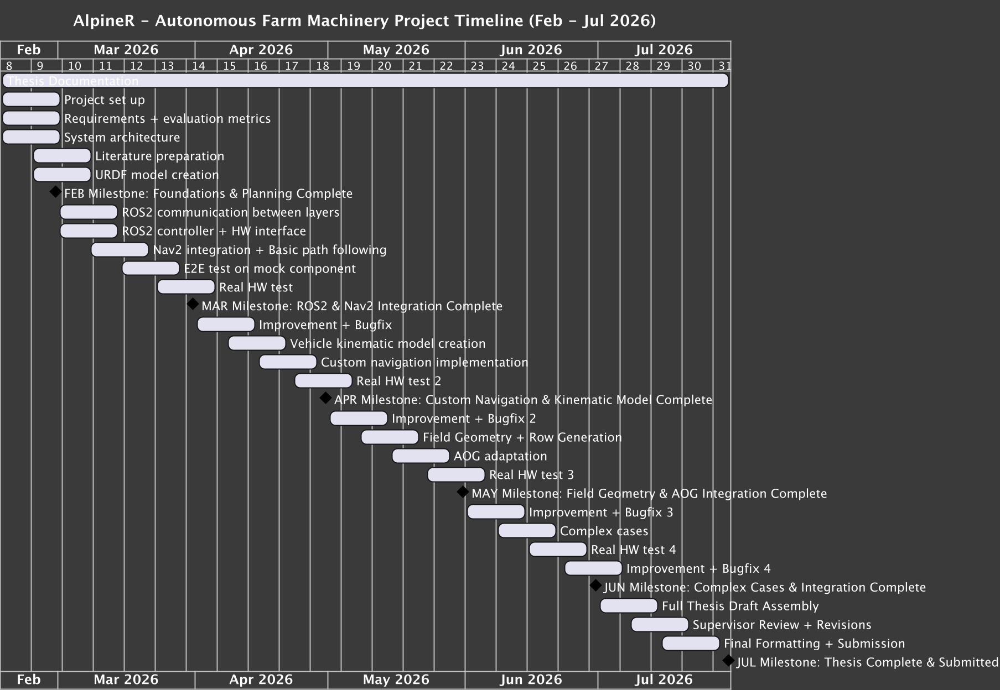

# ROS2 Based Robotic Automation
In this repository, you will find the ROS2-based software implementation for the AlpineR project, which focuses on developing an adaptable and testable automation retrofit kit for a construction loader. The project includes path planning and tracking for farm field tasks with repetitive moves, as well as the adaptation of AgOpenGPS (AOG) for comparative navigation control.

# Action Plan
Gantt Chart


# Getting Started
clone the repository and navigate to the ROS2 workspace:
```bash
git clone git@gitlab.ti.bfh.ch:mse_cs/spring26/master_thesis/alpiner/alpiner_ros2.git
cd alpiner_ros2/ros2_ws
```